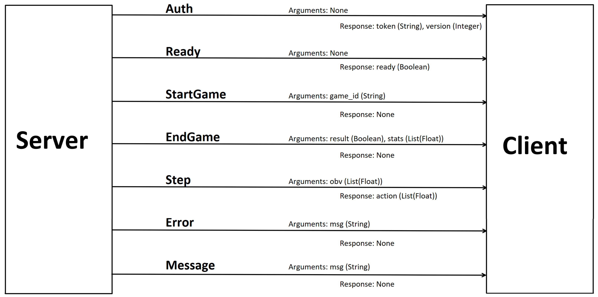

****************
Project Concepts
****************

IDs
===

This Project has 3 types of IDs: 

User-ID (int)
-------------

-  Primary Key for the User database
-  is linked to the matchmaking parameters and elo

Player-ID (UUID)
----------------

-  Is used to handel and identify clients internally
-  Only used during runtime
-  There can be different players with the same User-ID

Game-ID (UUID)
--------------

-  Is used to identify the game during runtime
-  Is used as a primary key in the game database
-  files name of the game files with all actions

Password/Token
==============

Username and Password
---------------------

-  Used for login to the website
-  can be freely chosen
-  username is used for leaderboard

Token
-----

-  get from the website
-  unique for every user (automatically generated)
-  used for authentication when connecting an agent to the server

AMP Protocol - shared/commands
==============================

Database
========

UserData
--------

.. autoclass:: comprl.server.data.sql_backend.User
    :members:
    :undoc-members:

GameData
--------

.. autoclass:: comprl.server.data.sql_backend.Game
    :members:
    :undoc-members:

Matchmaking
===========

Principle
---------

-  Each player get’s a rating consisting (mainly) of:

   -  a :math:`\mu` (``mu``) value: The average performance of the
      player
   -  a :math:`\sigma` (``sigma``) value: The uncertainty of the skill

-  ratings are used to predict outcomes of a game
-  updated after a game

Functionality
-------------

-  Agents joining are put in the queue
-  Fix percentage of online players are always waiting in queue
-  Every few seconds matchmaking is updated and possible matches are
   formed
-  match is suitable if:
   :math:`\textit{probability of a draw} + \textit{time bonus} > \textit{threshold}`
-  :math:`\textit{time bonus} = \textit{combined waiting time in min}\cdot \textit{0.1}`
-  after a match ``mu`` and ``sigma`` are updated based on score

Documentation
=============

`Here <https://github.com/martius-lab/teamproject-competition-server/tree/main/documentation>`__
a documentation that was generated with `pdoc <https://pdoc.dev>`__.
Open ``documentation/comprl.html`` to see this documentation.

Coding conventions
==================

This project follows the
`Google-Styleguide <https://google.github.io/styleguide/>`__
